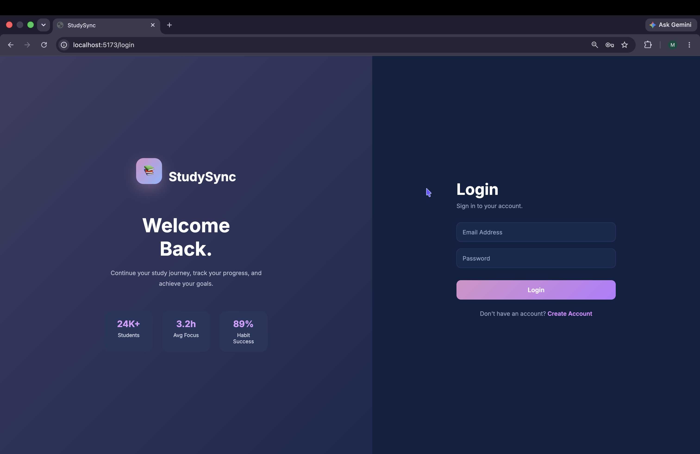
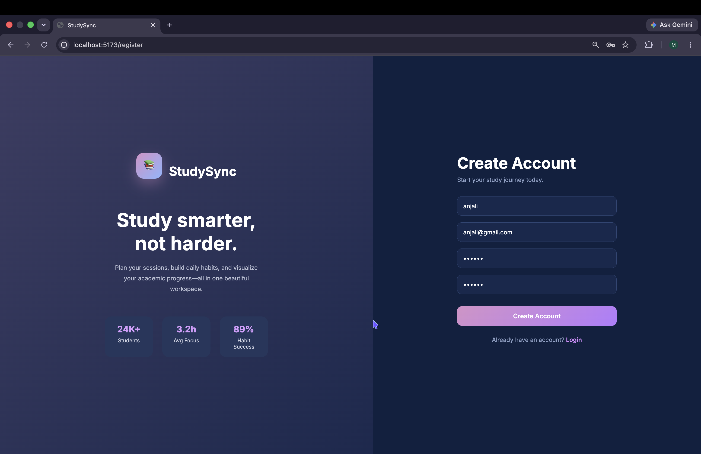
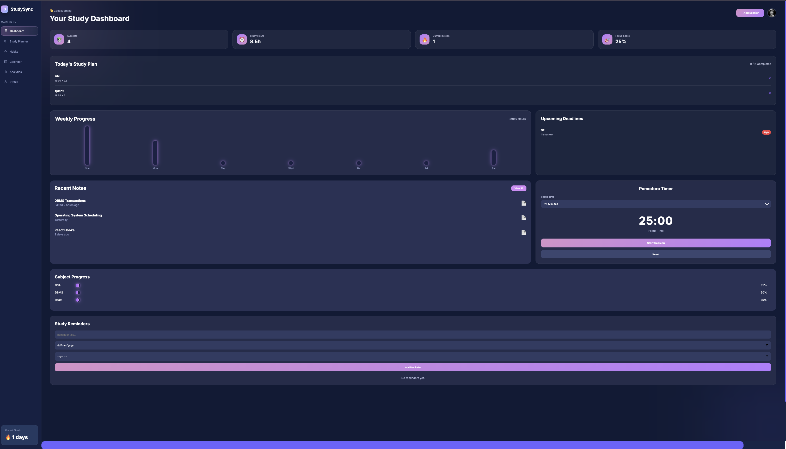
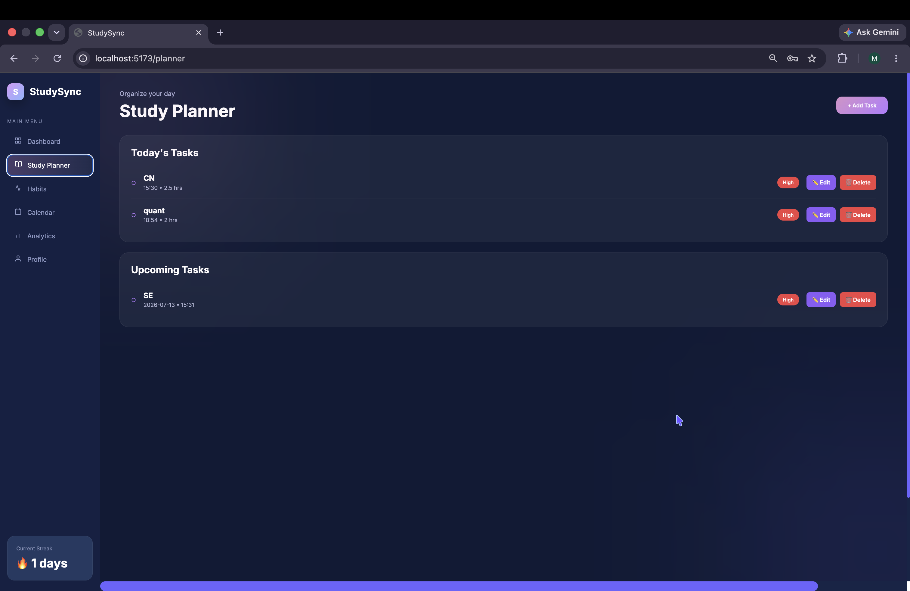
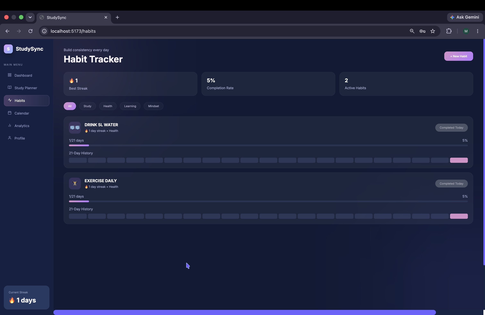
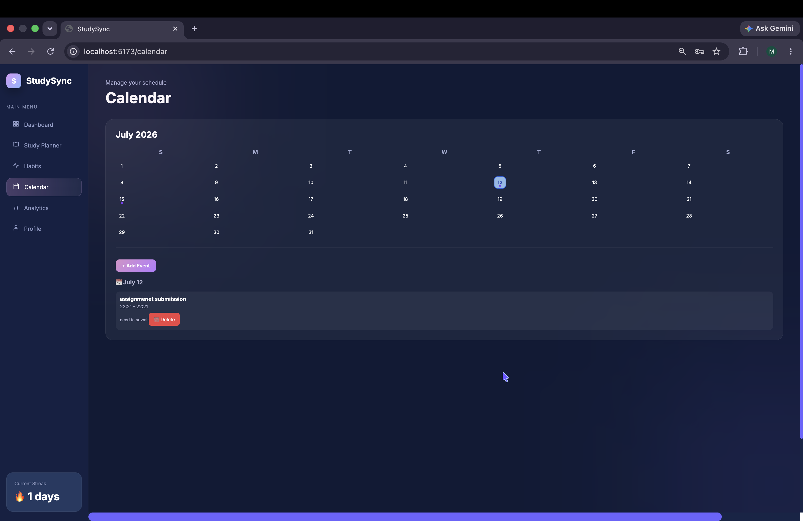
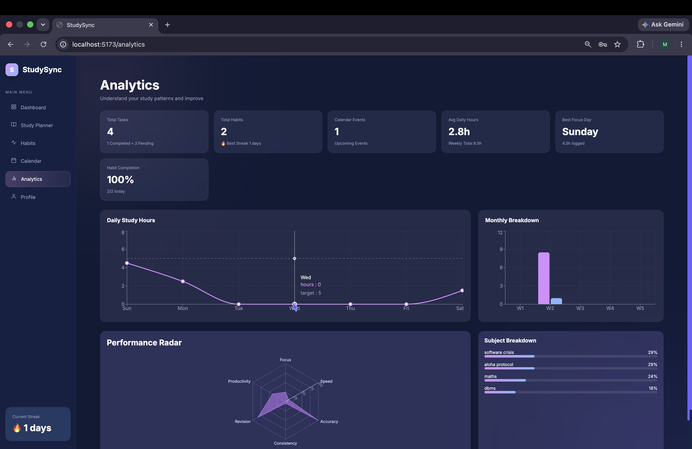
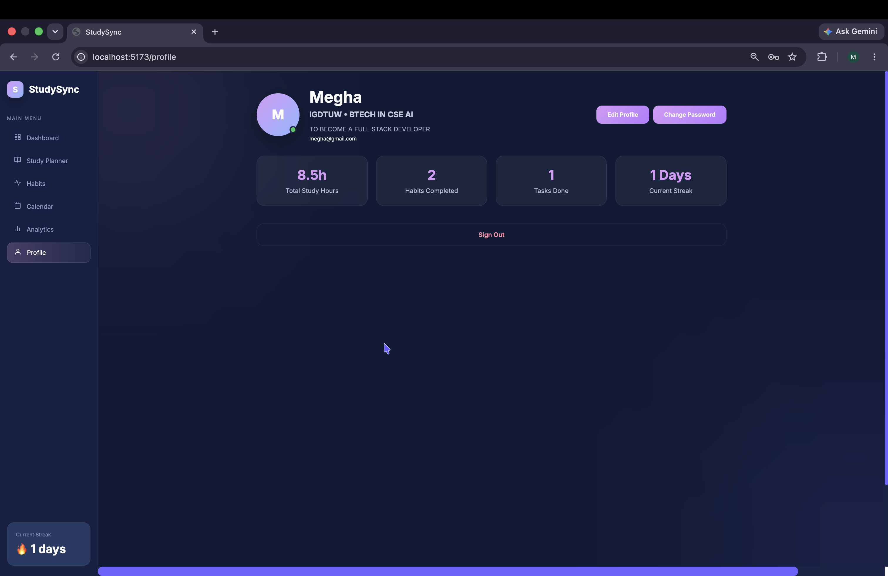

# 📚 StudySync

<h3 align="center">
A Modern MERN Stack Productivity Platform for Students
</h3>

<p align="center">


</p>

---

# 📖 Overview

StudySync is a **full-stack MERN application** developed to help students stay organized and productive throughout their academic journey.

The platform enables users to:

- 📅 Plan study tasks
- 🔥 Track daily habits
- 📆 Schedule calendar events
- 📊 Analyze study performance
- 👤 Manage personal profiles

All data is securely stored using **MongoDB** and protected through **JWT Authentication**.

---

# ✨ Features

## 🔐 Authentication

- User Registration
- Secure Login
- JWT Authentication
- Protected Routes
- Persistent Login

---

## 📅 Study Planner

- Create Tasks
- Edit Tasks
- Delete Tasks
- Mark Tasks as Completed
- Track Study Duration

---

## 🔥 Habit Tracker

- Create Daily Habits
- Mark Habits Complete
- Automatic Streak Calculation
- 21-Day Habit History

---

## 📆 Calendar

- Add Events
- Delete Events
- Event Indicators
- Today's Date Highlight

---

## 📊 Analytics Dashboard

- Daily Study Hours
- Weekly Study Progress
- Monthly Statistics
- Subject Breakdown
- Performance Radar
- Habit Completion Rate

---

## 👤 Profile

- Edit Profile
- Update Bio
- College & Course Information
- View Study Statistics
- Secure Logout

---

# 🛠 Tech Stack

## Frontend

- React.js
- React Router DOM
- Context API
- Axios
- CSS3
- Recharts

## Backend

- Node.js
- Express.js
- MongoDB Atlas
- Mongoose
- JWT Authentication
- bcryptjs

---

# 📂 Project Structure

```text
StudySync
│
├── backend
│   ├── config
│   ├── controllers
│   ├── middleware
│   ├── models
│   ├── routes
│   └── server.js
│
├── frontend
│   ├── src
│   │   ├── api
│   │   ├── components
│   │   ├── context
│   │   ├── pages
│   │   ├── styles
│   │   └── App.jsx
│
├── assets
│   ├── screenshots
│   └── video
│
└── README.md
```

---

# 🎥 Demo Video

Store your demo video inside:

```
assets/video/demo.mp4
```

Or replace this section later with your YouTube, Loom, or Google Drive demo link.

---

# 📸 Application Screenshots

## 🔐 Login

<p align="center">

</p>

---

## 📝 Register

<p align="center">

</p>

---

## 🏠 Dashboard

<p align="center">

</p>

---

## 📅 Planner

<p align="center">

</p>

---

## 🔥 Habit Tracker

<p align="center">

</p>

---

## 📆 Calendar

<p align="center">

</p>

---

## 📊 Analytics

<p align="center">

</p>

---

## 👤 Profile

<p align="center">

</p>

---

# 🚀 Installation & Setup

## 1️⃣ Clone the Repository

```bash
git clone https://github.com/guiltlesskiwi/StudySync.git
```

Move into the project folder.

```bash
cd StudySync
```

---

## 2️⃣ Backend Setup

Open Terminal 1.

```bash
cd backend
```

Install dependencies.

```bash
npm install
```

---

## 3️⃣ Configure Environment Variables

Create a `.env` file inside the **backend** folder.

```env
PORT=3001
MONGO_URI=YOUR_MONGODB_CONNECTION_STRING
JWT_SECRET=YOUR_SECRET_KEY
```

Replace:

- `YOUR_MONGODB_CONNECTION_STRING` with your MongoDB Atlas URI.
- `YOUR_SECRET_KEY` with any secure random string.

---

## 4️⃣ Start Backend

```bash
npm run dev
```

Expected Output:

```
Server running on port 3001
MongoDB Connected
```

---

## 5️⃣ Frontend Setup

Open a second terminal.

```bash
cd frontend
```

Install dependencies.

```bash
npm install
```

---

## 6️⃣ Start Frontend

```bash
npm run dev
```

Open:

```
http://localhost:5173
```

---

# 📦 Dependencies

## Backend

```bash
npm install express mongoose cors dotenv bcryptjs jsonwebtoken
npm install --save-dev nodemon
```

## Frontend

```bash
npm install axios react-router-dom recharts
```

---

# 🌱 Future Improvements

- 🤖 AI Study Recommendations
- ⏳ Pomodoro Timer
- 📧 Email Notifications
- ☁️ File Upload Support
- 🌙 Dark Mode
- 📱 Mobile Responsive Design

---

# 👩‍💻 Author

**Megha Jha**

**B.Tech Computer Science Engineering (AI)**

**Indira Gandhi Delhi Technical University for Women (IGDTUW)**

---

# ⭐ Show Your Support

If you found this project useful, consider giving it a ⭐ on GitHub!
